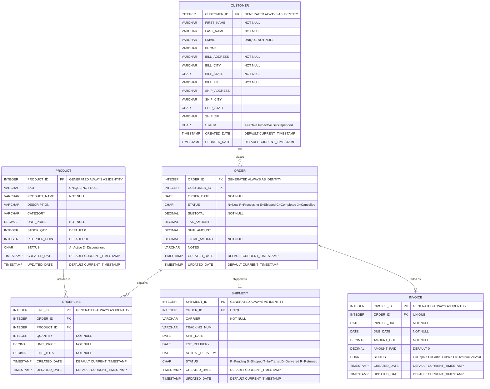

# IBM i Order Management System — Application Design

> **Status:** Living document — updated alongside the codebase.

---

## Table of Contents

1. [Overview & Purpose](#1-overview--purpose)
2. [Architecture & Design](#2-architecture--design)
3. [Database Schema Design](#3-database-schema-design)
4. [Service Layer API Reference](#4-service-layer-api-reference)
5. [UI Layer — Programs & Display Files](#5-ui-layer--programs--display-files)
6. [Data Conventions & Error Handling Patterns](#6-data-conventions--error-handling-patterns)

---

## 1. Overview & Purpose

The **IBM i Order Management System** is a fully free-format ILE RPG application running on IBM i. It provides core order management functionality across five domains:

| Domain | Description |
|---|---|
| **Customer Management** | Customer profiles, contact info, billing/shipping addresses, account status |
| **Product Management** | Product catalog, SKUs, pricing, stock levels, categories |
| **Order Management** | Sales orders, order lines, order status lifecycle, totals |
| **Shipment Management** | Shipment tracking, carrier info, tracking numbers, delivery status |
| **Invoice Management** | Invoice generation, payment status, due dates, line-level billing |

### Design Goals

- **Separation of concerns** — Database, business logic, and presentation are cleanly separated into distinct ILE layers.
- **Reusability** — All business logic lives in ILE service programs (`*SRVPGM`) so that any future program (batch, interactive, REST handler) can call the same APIs.
- **Consistency** — A shared `ApiResult_t` structure provides uniform success/error handling across every procedure.
- **Maintainability** — The TOBi (`makei`) build system tracks source-to-object dependencies automatically, ensuring only changed objects are rebuilt.

### Technology Stack

| Layer | Technology |
|---|---|
| Operating System | IBM i 7.4 |
| Database | Db2 for IBM i (SQL DDL via `RUNSQLSTM`) |
| Business Logic | ILE RPG (fully free-format SQLRPGLE) |
| Presentation | 5250 interactive programs + DDS display files |
| Build | [TOBi / `makei`](https://ibm.github.io/ibmi-tobi/#/) |

### Source Directory Layout

```
rpg-app/
├── qsqlsrc/      SQL DDL & procedures  (.table = CREATE TABLE,  .sql = CREATE PROCEDURE)
├── qrpglesrc/    ILE RPG source        (.sqlrpgle = service modules,  .rpgle = UI programs)
├── qrpgleref/    RPG include files     (.rpgleinc = data structure & prototype declarations)
├── qbndsrc/      Binder source         (.bnd = service program export lists)
└── qddssrc/      DDS source            (.dspf = display file definitions)
```

Each subdirectory maps to a source physical file of the same name on IBM i (`QSQLSRC`, `QRPGLESRC`, etc.).

---

## 2. Architecture & Design

The system follows a strict **three-tier ILE architecture**: presentation → service → database. Each tier is independently compiled and linked, allowing any tier to be changed without recompiling others (as long as the exported interface is unchanged).

```
┌─────────────────────────────────────────────────────────────────┐
│                     PRESENTATION TIER                           │
│   5250 Interactive Programs  +  DDS Display Files               │
│  MAINMENU.PGM  CUSTMNT.PGM   PRODMNT.PGM                       │
│  ORDERMNT.PGM  SHIPMNT.PGM   INVMNT.PGM                        │
└──────────────────────────┬──────────────────────────────────────┘
                           │  calls via ORDERMGMT binding directory
┌──────────────────────────▼──────────────────────────────────────┐
│                      SERVICE TIER                               │
│   ILE Service Programs  (*SRVPGM)                               │
│   CUSTOMER.SRVPGM   PRODUCT.SRVPGM                              │
│   ORDER.SRVPGM      SHIPMENT.SRVPGM   INVOICE.SRVPGM           │
└──────────────────────────┬──────────────────────────────────────┘
                           │  embedded SQL
┌──────────────────────────▼──────────────────────────────────────┐
│                      DATABASE TIER                              │
│   Db2 for IBM i Tables  (*FILE)                                 │
│   CUSTOMER.FILE   PRODUCT.FILE                                  │
│   ORDER.FILE      ORDERLINE.FILE                                │
│   SHIPMENT.FILE   INVOICE.FILE                                  │
└─────────────────────────────────────────────────────────────────┘
```

### ILE Object Relationships

```
MAINMENU.PGM (*PGM)
  ├── CUSTMNT.PGM   (*PGM) ──► CUSTOMER.SRVPGM  (*SRVPGM) ──► CUSTOMER  (*FILE)
  ├── PRODMNT.PGM   (*PGM) ──► PRODUCT.SRVPGM   (*SRVPGM) ──► PRODUCT   (*FILE)
  ├── ORDERMNT.PGM  (*PGM) ──► ORDER.SRVPGM     (*SRVPGM) ──► ORDER     (*FILE)
  │                                                          ──► ORDERLINE (*FILE)
  ├── SHIPMNT.PGM   (*PGM) ──► SHIPMENT.SRVPGM  (*SRVPGM) ──► SHIPMENT  (*FILE)
  └── INVMNT.PGM    (*PGM) ──► INVOICE.SRVPGM   (*SRVPGM) ──► INVOICE   (*FILE)

All *MNT programs and MAINMENU.PGM resolve service programs via:
  ORDERMGMT.BNDDIR  (*BNDDIR)
```

### IBM i Object Types Used

Every component in this application maps to a specific IBM i system object type stored in QSYS:

| Object Type | Description | Used For |
|---|---|---|
| `*FILE` (PF) | Physical file / Db2 table | All six database tables (`CUSTOMER`, `PRODUCT`, etc.) |
| `*FILE` (DSPF) | Display file | All six DDS screen files (`MAINMENU.FILE`, `CUSTMNT.FILE`, etc.) |
| `*MODULE` | Non-runnable ILE module — output of an ILE compiler | Intermediate build artifact for each SQLRPGLE source member |
| `*SRVPGM` | ILE service program — shareable exported procedures | `CUSTOMER.SRVPGM`, `PRODUCT.SRVPGM`, `ORDER.SRVPGM`, `SHIPMENT.SRVPGM`, `INVOICE.SRVPGM` |
| `*PGM` | ILE bound program — runnable entry point | `MAINMENU.PGM`, `CUSTMNT.PGM`, `PRODMNT.PGM`, `ORDERMNT.PGM`, `SHIPMNT.PGM`, `INVMNT.PGM` |
| `*BNDDIR` | Binding directory — groups service programs for resolution at compile time | `ORDERMGMT.BNDDIR` |
| `*SQLPKG` | SQL package — created automatically by the SQL pre-compiler per program | One per SQLRPGLE program/service program |

> **Note:** A `*MODULE` object is a non-runnable object that is the output of an ILE compiler. It is the basic building block for creating runnable ILE objects (`*PGM`, `*SRVPGM`). An SQL table created with `CREATE TABLE` is represented in QSYS as a `*FILE` object — the same object type as a traditional DDS physical file.

### Key Design Decisions

#### 1. Service Programs over Bound Programs

Each domain (customer, product, order, shipment, invoice) is compiled as an ILE `*MODULE` first, then linked into a `*SRVPGM`. This means:

- Multiple programs can share the same activated service program in memory.
- The service program interface is version-controlled via binder source (`.bnd`) with a fixed `SIGNATURE`.
- Adding new procedures does not break existing callers as long as existing exports remain unchanged.

#### 2. Binding Directory — `ORDERMGMT.BNDDIR`

All five service programs are registered in a single binding directory. Maintenance programs declare:

```rpgle
ctl-opt bnddir('ORDERMGMT');
```

This allows any maintenance program to call any API from any service program without knowing which `*SRVPGM` it lives in — a clean inversion of dependency.

#### 3. Activity Groups

| Program | `ACTGRP` | Reason |
|---|---|---|
| `MAINMENU.PGM` | `*NEW` | Isolated activation group; caller controls lifetime |
| `*MNT` programs | `*NEW` | Each call gets a fresh activation group |
| Service programs | `*CALLER` (default) | Runs in the calling program's activation group, sharing SQL connections and open files |

#### 4. Embedded SQL for Data Access

All database interaction uses **embedded SQL** within SQLRPGLE modules. This provides:

- Full Db2 for i SQL feature access (identity columns, `OFFSET`/`FETCH`, cursors, constraint-aware errors).
- Compile-time SQL syntax checking via the SQL pre-compiler.
- No need for traditional RPG file declarations for data access.

---

## 3. Database Schema Design

### Source File Type — `.table` and `.sql` (SQL DDL via `RUNSQLSTM`)

All six tables are defined using **SQL DDL** (`CREATE TABLE` statements) and five stored procedures are defined using `CREATE PROCEDURE` statements. All are stored as source members in `qsqlsrc/` and executed using the IBM i `RUNSQLSTM` (Run SQL Statements) command.

> **Source Member Types:** IBM i does not define a member type called `SQLPRC`. The standard source member type for any SQL DDL/DML source processed by `RUNSQLSTM` is **`SQL`** — this covers `CREATE TABLE`, `CREATE PROCEDURE`, `ALTER TABLE`, `DROP`, `INSERT`, and all other SQL statements. The `.table` extension used for table definitions is a **TOBi (`makei`) build-tool convention** only — it is not an IBM i platform member type. The correct IBM i member type for all SQL source, whether it defines a table or a stored procedure, is **`SQL`**.

> **`RUNSQLSTM`:** The SQL statement processor allows SQL statements to be run from a source member or stream file without compilation. Statements do not use `EXEC SQL`; each statement ends with a semicolon. For source members, only the first 80 characters of each record are read by default (the `MARGINS` parameter can extend this). A commitment-control level is specified via the `COMMIT` parameter — `COMMIT(*NONE)` is typical for DDL. The `NAMING` parameter controls whether SQL or system naming conventions apply.

> **How to compile — `RUNSQLSTM` syntax:**
> ```cl
> RUNSQLSTM SRCFILE(YOURLIB/QSQLSRC) SRCMBR(CUSTOMERS)  COMMIT(*NONE) NAMING(*SYS)
> RUNSQLSTM SRCFILE(YOURLIB/QSQLSRC) SRCMBR(POPCUSTOMERS) COMMIT(*NONE) NAMING(*SYS)
> ```
> Key parameters:
> - `SRCFILE` — library-qualified source physical file containing the member
> - `SRCMBR` — name of the source member to run
> - `COMMIT(*NONE)` — no commitment control; standard for DDL and procedure creation
> - `NAMING(*SYS)` — use system naming (`LIB/OBJ`); use `*SQL` for schema.object naming
> - `MARGINS(1 80)` — default; reads columns 1–80 of each record

The `.table` extension is a TOBi (`makei`) build-tool convention: TOBi detects the extension and invokes `RUNSQLSTM` automatically. The correct **IBM i member type** stored in the source physical file is **`SQL`** for all members in this source file.

| Source Member | IBM i Member Type | TOBi Extension | Compile Command | Resulting Object |
|---|---|---|---|---|
| `customers` | `SQL` | `.table` | `RUNSQLSTM` | `CUSTOMER` (`*FILE`) |
| `products` | `SQL` | `.table` | `RUNSQLSTM` | `PRODUCT` (`*FILE`) |
| `orders` | `SQL` | `.table` | `RUNSQLSTM` | `ORDER` (`*FILE`) |
| `orderlines` | `SQL` | `.table` | `RUNSQLSTM` | `ORDERLINE` (`*FILE`) |
| `shipments` | `SQL` | `.table` | `RUNSQLSTM` | `SHIPMENT` (`*FILE`) |
| `invoices` | `SQL` | `.table` | `RUNSQLSTM` | `INVOICE` (`*FILE`) |
| `popcustomers` | `SQL` | `.sql` | `RUNSQLSTM` | `POPCUSTOMERS` (SQL stored procedure) |
| `popproducts` | `SQL` | `.sql` | `RUNSQLSTM` | `POPPRODUCTS` (SQL stored procedure) |
| `poporders` | `SQL` | `.sql` | `RUNSQLSTM` | `POPORDERS` (SQL stored procedure) |
| `popshipments` | `SQL` | `.sql` | `RUNSQLSTM` | `POPSHIPMENTS` (SQL stored procedure) |
| `popinvoices` | `SQL` | `.sql` | `RUNSQLSTM` | `POPINVOICES` (SQL stored procedure) |

### Entity-Relationship Diagram



### Table Details

#### `CUSTOMER` — Customer Master

| Column | Type | Constraint | Notes |
|---|---|---|---|
| `CUSTOMER_ID` | `INTEGER` | PK, Identity | Auto-generated, starts at 1 |
| `FIRST_NAME` | `VARCHAR(50)` | NOT NULL | |
| `LAST_NAME` | `VARCHAR(50)` | NOT NULL | |
| `EMAIL` | `VARCHAR(100)` | UNIQUE NOT NULL | Used as unique identifier |
| `PHONE` | `VARCHAR(20)` | | Optional |
| `BILL_ADDRESS` | `VARCHAR(200)` | NOT NULL | Billing address |
| `BILL_CITY` | `VARCHAR(50)` | NOT NULL | |
| `BILL_STATE` | `CHAR(2)` | NOT NULL | Two-letter US state code |
| `BILL_ZIP` | `VARCHAR(10)` | NOT NULL | |
| `SHIP_ADDRESS` | `VARCHAR(200)` | | Defaults to billing if blank |
| `SHIP_CITY` | `VARCHAR(50)` | | |
| `SHIP_STATE` | `CHAR(2)` | | |
| `SHIP_ZIP` | `VARCHAR(10)` | | |
| `STATUS` | `CHAR(1)` | CHECK (`A`,`I`,`S`) | Active / Inactive / Suspended |
| `CREATED_DATE` | `TIMESTAMP` | NOT NULL, DEFAULT | Audit |
| `UPDATED_DATE` | `TIMESTAMP` | NOT NULL, DEFAULT | Audit |

#### `PRODUCT` — Product Catalog

| Column | Type | Constraint | Notes |
|---|---|---|---|
| `PRODUCT_ID` | `INTEGER` | PK, Identity | |
| `SKU` | `VARCHAR(50)` | UNIQUE NOT NULL | Stock-keeping unit |
| `PRODUCT_NAME` | `VARCHAR(200)` | NOT NULL | |
| `DESCRIPTION` | `VARCHAR(1000)` | | Optional long description |
| `CATEGORY` | `VARCHAR(100)` | | e.g. Electronics, Apparel |
| `UNIT_PRICE` | `DECIMAL(11,2)` | NOT NULL | Sale price per unit |
| `STOCK_QTY` | `INTEGER` | DEFAULT 0 | Current on-hand quantity |
| `REORDER_POINT` | `INTEGER` | DEFAULT 10 | Trigger low-stock alert |
| `STATUS` | `CHAR(1)` | CHECK (`A`,`D`) | Active / Discontinued |
| `CREATED_DATE` | `TIMESTAMP` | NOT NULL, DEFAULT | Audit |
| `UPDATED_DATE` | `TIMESTAMP` | NOT NULL, DEFAULT | Audit |

#### `ORDER` — Sales Order Header

| Column | Type | Constraint | Notes |
|---|---|---|---|
| `ORDER_ID` | `INTEGER` | PK, Identity | |
| `CUSTOMER_ID` | `INTEGER` | FK → CUSTOMER, RESTRICT | |
| `ORDER_DATE` | `DATE` | NOT NULL | |
| `STATUS` | `CHAR(1)` | CHECK (`N`,`P`,`S`,`C`,`X`), DEFAULT `'N'` | New / Processing / Shipped / Completed / Cancelled |
| `SUBTOTAL` | `DECIMAL(13,2)` | NOT NULL | Sum of order lines |
| `TAX_AMOUNT` | `DECIMAL(11,2)` | DEFAULT 0 | |
| `SHIP_AMOUNT` | `DECIMAL(11,2)` | DEFAULT 0 | Shipping charges |
| `TOTAL_AMOUNT` | `DECIMAL(13,2)` | NOT NULL | Subtotal + Tax + Shipping |
| `NOTES` | `VARCHAR(1000)` | | Optional order notes |
| `CREATED_DATE` | `TIMESTAMP` | NOT NULL, DEFAULT | Audit |
| `UPDATED_DATE` | `TIMESTAMP` | NOT NULL, DEFAULT | Audit |

#### `ORDERLINE` — Order Line Items

| Column | Type | Constraint | Notes |
|---|---|---|---|
| `LINE_ID` | `INTEGER` | PK, Identity | |
| `ORDER_ID` | `INTEGER` | FK → ORDER, CASCADE DELETE | |
| `PRODUCT_ID` | `INTEGER` | FK → PRODUCT, RESTRICT | |
| `QUANTITY` | `INTEGER` | NOT NULL, CHECK > 0 | |
| `UNIT_PRICE` | `DECIMAL(11,2)` | NOT NULL | Price at time of order |
| `LINE_TOTAL` | `DECIMAL(13,2)` | NOT NULL | QUANTITY × UNIT_PRICE |
| `CREATED_DATE` | `TIMESTAMP` | NOT NULL, DEFAULT | Audit |
| `UPDATED_DATE` | `TIMESTAMP` | NOT NULL, DEFAULT | Audit |

> **Business Rule:** A unique constraint `UQ_ORDER_PRODUCT` on `(ORDER_ID, PRODUCT_ID)` prevents duplicate product lines on the same order. Quantity updates must go through `updateOrderLine`.

#### `SHIPMENT` — Shipment Tracking

| Column | Type | Constraint | Notes |
|---|---|---|---|
| `SHIPMENT_ID` | `INTEGER` | PK, Identity | |
| `ORDER_ID` | `INTEGER` | FK → ORDER, RESTRICT, UNIQUE | One shipment per order |
| `CARRIER` | `VARCHAR(100)` | NOT NULL | e.g. UPS, FedEx, USPS |
| `TRACKING_NUM` | `VARCHAR(100)` | | Carrier tracking number |
| `SHIP_DATE` | `DATE` | | Actual ship date |
| `EST_DELIVERY` | `DATE` | | Estimated delivery date |
| `ACTUAL_DELIVERY` | `DATE` | | Actual delivery date |
| `STATUS` | `CHAR(1)` | CHECK (`P`,`S`,`T`,`D`,`R`), DEFAULT `'P'` | Pending / Shipped / In-Transit / Delivered / Returned |
| `CREATED_DATE` | `TIMESTAMP` | NOT NULL, DEFAULT | Audit |
| `UPDATED_DATE` | `TIMESTAMP` | NOT NULL, DEFAULT | Audit |

#### `INVOICE` — Invoice & Payment

| Column | Type | Constraint | Notes |
|---|---|---|---|
| `INVOICE_ID` | `INTEGER` | PK, Identity | |
| `ORDER_ID` | `INTEGER` | FK → ORDER, RESTRICT, UNIQUE | One invoice per order |
| `INVOICE_DATE` | `DATE` | NOT NULL | Date invoice was issued |
| `DUE_DATE` | `DATE` | NOT NULL | Payment due date |
| `AMOUNT_DUE` | `DECIMAL(13,2)` | NOT NULL | Mirrors ORDER.TOTAL_AMOUNT |
| `AMOUNT_PAID` | `DECIMAL(13,2)` | DEFAULT 0 | Cumulative payments received |
| `STATUS` | `CHAR(1)` | CHECK (`U`,`P`,`F`,`O`,`V`), DEFAULT `'U'` | Unpaid / Partial / Paid / Overdue / Void |
| `CREATED_DATE` | `TIMESTAMP` | NOT NULL, DEFAULT | Audit |
| `UPDATED_DATE` | `TIMESTAMP` | NOT NULL, DEFAULT | Audit |

### Referential Integrity

| Child Table | References | Rule |
|---|---|---|
| `ORDER` | `CUSTOMER` | ON DELETE RESTRICT ON UPDATE RESTRICT |
| `ORDERLINE` | `ORDER` | ON DELETE CASCADE ON UPDATE RESTRICT |
| `ORDERLINE` | `PRODUCT` | ON DELETE RESTRICT ON UPDATE RESTRICT |
| `SHIPMENT` | `ORDER` | ON DELETE RESTRICT ON UPDATE RESTRICT |
| `INVOICE` | `ORDER` | ON DELETE RESTRICT ON UPDATE RESTRICT |

> **Note:** `ORDERLINE` uses `CASCADE DELETE` — removing an order automatically removes all its line items. All other relationships use `RESTRICT`.

### Sample Data Procedures

Five SQL stored procedures in `qsqlsrc/` populate tables with representative sample data for development. Each clears existing rows before inserting. Source members use the **`SQL`** member type (IBM i standard) with the `.sql` TOBi extension, compiled with `RUNSQLSTM`:

| Procedure | Source Member | IBM i Member Type | Records Inserted |
|---|---|---|---|
| `POPCUSTOMERS()` | `popcustomers.sql` | `SQL` | 10 customers |
| `POPPRODUCTS()` | `popproducts.sql` | `SQL` | 20 products |
| `POPORDERS()` | `poporders.sql` | `SQL` | 15 orders with line items |
| `POPSHIPMENTS()` | `popshipments.sql` | `SQL` | 12 shipments |
| `POPINVOICES()` | `popinvoices.sql` | `SQL` | 12 invoices |

To run any procedure manually after the tables are created:

```cl
RUNSQLSTM SRCFILE(YOURLIB/QSQLSRC) SRCMBR(member-name) COMMIT(*NONE) NAMING(*SYS)
```

Replace `member-name` with `POPCUSTOMERS`, `POPPRODUCTS`, `POPORDERS`, `POPSHIPMENTS`, or `POPINVOICES`.

---

## 4. Service Layer API Reference

### Compilation Sequence

Compile in this exact order — each step depends on the previous:

| Step | What | Command | Source |
|---|---|---|---|
| 1 | Database tables | `RUNSQLSTM` | `qsqlsrc/*.table` |
| 2 | Sample data procedures | `RUNSQLSTM` | `qsqlsrc/*.sql` |
| 3 | Service modules (`*MODULE`) | `CRTSQLRPGI` | `qrpglesrc/*.sqlrpgle` |
| 4 | Service programs (`*SRVPGM`) | `CRTSRVPGM` | `qbndsrc/*.bnd` |
| 5 | Binding directory (`*BNDDIR`) | `CRTBNDDIR` + `ADDBNDDIRE` | — |
| 6 | Display files (`*FILE` DSPF) | `CRTDSPF` | `qddssrc/*.dspf` |
| 7 | UI programs (`*PGM`) | `CRTBNDRPG` | `qrpglesrc/*.rpgle` |

> **Rule:** Never compile a step before its prerequisites exist. `CUSTMNT.PGM` (step 7) requires `CUSTMNT.FILE` (step 6) and `ORDERMGMT.BNDDIR` (step 5). `CUSTOMER.SRVPGM` (step 4) requires `CUSTOMER.MODULE` (step 3) and `CUSTOMER.FILE` (step 1).

### Source File Type — `.sqlrpgle` (SQLRPGLE via `CRTSQLRPGI`)

All five service modules are written as fully free-format SQLRPGLE source in `qrpglesrc/`. `CRTSQLRPGI` runs the SQL pre-compiler first, then the ILE RPG compiler to produce a `*MODULE`.

```cl
CRTSQLRPGI OBJ(YOURLIB/CUSTOMER) SRCFILE(YOURLIB/QRPGLESRC) SRCMBR(CUSTOMER)
           OBJTYPE(*MODULE) DBGVIEW(*SOURCE) RPGPPOPT(*LVL2) COMMIT(*NONE)
```

| Source Member | Extension | Resulting Object |
|---|---|---|
| `customer` | `.sqlrpgle` | `CUSTOMER` (`*MODULE`) |
| `product` | `.sqlrpgle` | `PRODUCT` (`*MODULE`) |
| `order` | `.sqlrpgle` | `ORDER` (`*MODULE`) |
| `shipment` | `.sqlrpgle` | `SHIPMENT` (`*MODULE`) |
| `invoice` | `.sqlrpgle` | `INVOICE` (`*MODULE`) |

### Binder Source (`.bnd`) and `CRTSRVPGM`

Each `*MODULE` is linked into a `*SRVPGM` using binder source in `qbndsrc/`. The binder source declares exported procedure names and fixes the service program signature — adding new procedures later will not break existing callers.

**Example — `customer.bnd`:**
```
STRPGMEXP PGMLVL(*CURRENT) SIGNATURE('CUSTOMER')
  EXPORT SYMBOL(createCustomer)
  EXPORT SYMBOL(getCustomer)
  EXPORT SYMBOL(updateCustomer)
  EXPORT SYMBOL(deleteCustomer)
  EXPORT SYMBOL(listCustomers)
  EXPORT SYMBOL(searchCustomers)
ENDPGMEXP
```

**Create the `*SRVPGM` (repeat for each domain):**
```cl
CRTSRVPGM SRVPGM(YOURLIB/CUSTOMER) MODULE(YOURLIB/CUSTOMER)
          EXPORT(*SRCFILE) SRCFILE(YOURLIB/QBNDSRC) SRCMBR(CUSTOMER)
          ACTGRP(*CALLER) AUT(*EXCLUDE)
```

**Create `ORDERMGMT.BNDDIR` — run once, then add each `*SRVPGM` individually using `ADDBNDDIRE BNDDIR(YOURLIB/ORDERMGMT) OBJ((YOURLIB/srvpgm-name *SRVPGM))` for each of the five service programs.**

### RPG Include Files — `qrpgleref/`

Each service program has a matching `.rpgleinc` in `qrpgleref/` containing its data structure and procedure prototypes. Any UI program calling a service program **must** `/include` these files:

```rpgle
/include qrpgleref/apiresult.rpgleinc
/include qrpgleref/customer.rpgleinc
```

The service tier is the authoritative layer for all business logic. Each domain has one `*SRVPGM` whose exports are declared in the binder source (`.bnd`) and whose procedure signatures are declared in the RPG include file (`.rpgleinc`).

### Shared: `ApiResult_t` — `apiresult.rpgleinc`

Every procedure returns this data structure:

```rpgle
dcl-ds ApiResult_t qualified template;
  success  ind;           // *on = success, *off = failure
  message  varchar(256);  // Human-readable status or error message
                          // For create operations: contains the generated ID
                          // For list operations: contains the record count
  sqlstate char(5);       // Raw SQLSTATE from Db2
end-ds;
```

The caller checks `result.success` and uses `result.message` and `result.sqlstate` for diagnostics.

---

### 4.1 `CUSTOMER.SRVPGM` — `customer.sqlrpgle` / `customer.rpgleinc`

**Binder Signature:** `CUSTOMER`  
**Exports:** 6 procedures

#### `Customer_t` Data Structure

```rpgle
dcl-ds Customer_t qualified template;
  customerId   int(10);
  firstName    varchar(50);
  lastName     varchar(50);
  email        varchar(100);
  phone        varchar(20);
  billAddress  varchar(200);
  billCity     varchar(50);
  billState    char(2);
  billZip      varchar(10);
  shipAddress  varchar(200);
  shipCity     varchar(50);
  shipState    char(2);
  shipZip      varchar(10);
  status       char(1);       // A=Active I=Inactive S=Suspended
  createdDate  timestamp;
  updatedDate  timestamp;
end-ds;
```

#### Procedures

| Procedure | Signature | Description |
|---|---|---|
| `createCustomer` | `(customer : Customer_t) → ApiResult_t` | INSERT — returns generated ID in `message` |
| `getCustomer` | `(customerId : int(10), customer : Customer_t) → ApiResult_t` | SELECT by PK |
| `updateCustomer` | `(customer : Customer_t const) → ApiResult_t` | UPDATE all columns by PK |
| `deleteCustomer` | `(customerId : int(10) const) → ApiResult_t` | DELETE by PK |
| `listCustomers` | `(customers[], maxRecords?, offset?) → ApiResult_t` | Paginated list; count in `message` |
| `searchCustomers` | `(searchTerm, customers[], maxRecords?) → ApiResult_t` | LIKE search on `FIRST_NAME`, `LAST_NAME`, `EMAIL` |

---

### 4.2 `PRODUCT.SRVPGM` — `product.sqlrpgle` / `product.rpgleinc`

**Binder Signature:** `PRODUCT`  
**Exports:** 7 procedures

#### `Product_t` Data Structure

```rpgle
dcl-ds Product_t qualified template;
  productId    int(10);
  sku          varchar(50);
  productName  varchar(200);
  description  varchar(1000);
  category     varchar(100);
  unitPrice    packed(11:2);
  stockQty     int(10);
  reorderPoint int(10);
  status       char(1);       // A=Active D=Discontinued
  createdDate  timestamp;
  updatedDate  timestamp;
end-ds;
```

#### Procedures

| Procedure | Signature | Description |
|---|---|---|
| `createProduct` | `(product : Product_t) → ApiResult_t` | INSERT — returns generated ID in `message` |
| `getProduct` | `(productId : int(10), product : Product_t) → ApiResult_t` | SELECT by PK |
| `updateProduct` | `(product : Product_t const) → ApiResult_t` | UPDATE all columns by PK |
| `deleteProduct` | `(productId : int(10) const) → ApiResult_t` | DELETE by PK |
| `listProducts` | `(products[], maxRecords?, offset?) → ApiResult_t` | Paginated list |
| `searchProducts` | `(searchTerm, products[], maxRecords?) → ApiResult_t` | LIKE search on `SKU`, `PRODUCT_NAME`, `CATEGORY` |
| `adjustStock` | `(productId : int(10) const, qty : int(10) const) → ApiResult_t` | Increment/decrement `STOCK_QTY`; returns `*off` if stock would go negative |

---

### 4.3 `ORDER.SRVPGM` — `order.sqlrpgle` / `order.rpgleinc`

**Binder Signature:** `ORDER`  
**Exports:** 8 procedures

#### `Order_t` Data Structure

```rpgle
dcl-ds Order_t qualified template;
  orderId      int(10);
  customerId   int(10);       // FK → CUSTOMER
  orderDate    date;
  status       char(1);       // N=New P=Processing S=Shipped C=Completed X=Cancelled
  subtotal     packed(13:2);
  taxAmount    packed(11:2);
  shipAmount   packed(11:2);
  totalAmount  packed(13:2);
  notes        varchar(1000);
  createdDate  timestamp;
  updatedDate  timestamp;
end-ds;
```

#### `OrderLine_t` Data Structure

```rpgle
dcl-ds OrderLine_t qualified template;
  lineId       int(10);
  orderId      int(10);       // FK → ORDER
  productId    int(10);       // FK → PRODUCT
  quantity     int(10);
  unitPrice    packed(11:2);
  lineTotal    packed(13:2);
  createdDate  timestamp;
  updatedDate  timestamp;
end-ds;
```

#### Procedures

| Procedure | Signature | Description |
|---|---|---|
| `createOrder` | `(order : Order_t) → ApiResult_t` | INSERT order header — returns generated ORDER_ID in `message` |
| `getOrder` | `(orderId : int(10), order : Order_t) → ApiResult_t` | SELECT order header by PK |
| `updateOrderStatus` | `(orderId : int(10) const, status : char(1) const) → ApiResult_t` | Update `STATUS` only |
| `cancelOrder` | `(orderId : int(10) const) → ApiResult_t` | Sets `STATUS = 'X'`; restores product stock |
| `listOrders` | `(orders[], maxRecords?, offset?) → ApiResult_t` | Paginated list of order headers |
| `getOrdersByCustomer` | `(customerId, orders[], maxRecords?) → ApiResult_t` | All orders for a customer |
| `addOrderLine` | `(line : OrderLine_t) → ApiResult_t` | INSERT line; recalculates order totals; decrements stock |
| `removeOrderLine` | `(lineId : int(10) const) → ApiResult_t` | DELETE line; recalculates order totals; restores stock |

---

### 4.4 `SHIPMENT.SRVPGM` — `shipment.sqlrpgle` / `shipment.rpgleinc`

**Binder Signature:** `SHIPMENT`  
**Exports:** 6 procedures

#### `Shipment_t` Data Structure

```rpgle
dcl-ds Shipment_t qualified template;
  shipmentId      int(10);
  orderId         int(10);      // FK → ORDER
  carrier         varchar(100);
  trackingNum     varchar(100);
  shipDate        date;
  estDelivery     date;
  actualDelivery  date;
  status          char(1);      // P=Pending S=Shipped T=In-Transit D=Delivered R=Returned
  createdDate     timestamp;
  updatedDate     timestamp;
end-ds;
```

#### Procedures

| Procedure | Signature | Description |
|---|---|---|
| `createShipment` | `(shipment : Shipment_t) → ApiResult_t` | INSERT — returns generated ID; also sets ORDER.STATUS = 'S' |
| `getShipment` | `(shipmentId : int(10), shipment : Shipment_t) → ApiResult_t` | SELECT by PK |
| `updateShipment` | `(shipment : Shipment_t const) → ApiResult_t` | UPDATE all columns by PK |
| `markDelivered` | `(shipmentId : int(10) const, deliveryDate : date const) → ApiResult_t` | Sets STATUS = 'D', ACTUAL_DELIVERY; also sets ORDER.STATUS = 'C' |
| `listShipments` | `(shipments[], maxRecords?, offset?) → ApiResult_t` | Paginated list |
| `getShipmentByOrder` | `(orderId : int(10), shipment : Shipment_t) → ApiResult_t` | SELECT by ORDER_ID (1:1 relationship) |

---

### 4.5 `INVOICE.SRVPGM` — `invoice.sqlrpgle` / `invoice.rpgleinc`

**Binder Signature:** `INVOICE`  
**Exports:** 7 procedures

#### `Invoice_t` Data Structure

```rpgle
dcl-ds Invoice_t qualified template;
  invoiceId    int(10);
  orderId      int(10);       // FK → ORDER
  invoiceDate  date;
  dueDate      date;
  amountDue    packed(13:2);
  amountPaid   packed(13:2);
  status       char(1);       // U=Unpaid P=Partial F=Paid O=Overdue V=Void
  createdDate  timestamp;
  updatedDate  timestamp;
end-ds;
```

#### Procedures

| Procedure | Signature | Description |
|---|---|---|
| `createInvoice` | `(invoice : Invoice_t) → ApiResult_t` | INSERT — returns generated ID in `message` |
| `getInvoice` | `(invoiceId : int(10), invoice : Invoice_t) → ApiResult_t` | SELECT by PK |
| `updateInvoice` | `(invoice : Invoice_t const) → ApiResult_t` | UPDATE all columns by PK |
| `applyPayment` | `(invoiceId : int(10) const, amount : packed(13:2) const) → ApiResult_t` | Adds to AMOUNT_PAID; auto-updates STATUS to P/F |
| `voidInvoice` | `(invoiceId : int(10) const) → ApiResult_t` | Sets STATUS = 'V' |
| `listInvoices` | `(invoices[], maxRecords?, offset?) → ApiResult_t` | Paginated list |
| `getInvoiceByOrder` | `(orderId : int(10), invoice : Invoice_t) → ApiResult_t` | SELECT by ORDER_ID (1:1 relationship) |

---

## 5. UI Layer — Programs & Display Files

### Source File Type — `.dspf` (DDS via `CRTDSPF`) and `.rpgle` (RPG via `CRTBNDRPG`)

Display files are defined using **DDS (Data Description Specifications)** source members in `qddssrc/` with the `.dspf` extension, compiled using `CRTDSPF` (Create Display File). Interactive programs are written in free-format ILE RPG with the `.rpgle` extension in `qrpglesrc/`, compiled using `CRTBNDRPG`.

| Source Member | Extension | Compile Tool | Resulting Object |
|---|---|---|---|
| `mainmenu` | `.dspf` | `CRTDSPF` | `MAINMENU` (`*FILE` DSPF) |
| `custmnt` | `.dspf` | `CRTDSPF` | `CUSTMNT` (`*FILE` DSPF) |
| `prodmnt` | `.dspf` | `CRTDSPF` | `PRODMNT` (`*FILE` DSPF) |
| `ordermnt` | `.dspf` | `CRTDSPF` | `ORDERMNT` (`*FILE` DSPF) |
| `shipmnt` | `.dspf` | `CRTDSPF` | `SHIPMNT` (`*FILE` DSPF) |
| `invmnt` | `.dspf` | `CRTDSPF` | `INVMNT` (`*FILE` DSPF) |
| `mainmenu.pgm` | `.rpgle` | `CRTBNDRPG` | `MAINMENU` (`*PGM`) |
| `custmnt.pgm` | `.rpgle` | `CRTBNDRPG` | `CUSTMNT` (`*PGM`) |
| `prodmnt.pgm` | `.rpgle` | `CRTBNDRPG` | `PRODMNT` (`*PGM`) |
| `ordermnt.pgm` | `.rpgle` | `CRTBNDRPG` | `ORDERMNT` (`*PGM`) |
| `shipmnt.pgm` | `.rpgle` | `CRTBNDRPG` | `SHIPMNT` (`*PGM`) |
| `invmnt.pgm` | `.rpgle` | `CRTBNDRPG` | `INVMNT` (`*PGM`) |

### Display File Screen Size Restrictions

> **DDS Display Files:** The standard 5250 terminal screen size is **24 rows × 80 columns** (`*DS3` — `DSPSIZ(24 80)`). An extended screen size of **27 rows × 132 columns** (`*DS4`) is also supported on specific hardware (3180-2, 3197, 3477, 3487 series controllers). The default, and most common, screen size is 24×80.
>
> Key restrictions that apply to this application's display files:
> - **All display files in this application are coded for 24×80 (`*DS3`) only** — the standard 5250 screen. No field may be placed beyond column 80 or below row 24.
> - A field **cannot occupy position column 1 on any row** — column 1 is always reserved for the field's beginning attribute character.
> - The maximum number of record formats per display file is **1,024**.
> - The maximum number of named fields per record format is **32,763** (combined length ≤ 32,763 bytes).
> - The maximum number of fields that can be **displayed** per record format is **4,095**.
> - The maximum length of a **character field** equals the display size minus one (i.e., 1,919 characters on a 24×80 screen). The maximum length of a **numeric (zoned decimal)** field is **63 positions**.
> - For menu record formats (like `MAINMENU`), IBM i requires the display size to be exactly **24 rows × 80 columns** — the menu format name must also match the display file name.

### Program Inventory

| Program | Source | Display File | Description |
|---|---|---|---|
| `MAINMENU.PGM` | `mainmenu.pgm.rpgle` | `MAINMENU.FILE` | Entry point; routes user to maintenance screens |
| `CUSTMNT.PGM` | `custmnt.pgm.rpgle` | `CUSTMNT.FILE` | Full CRUD for customer records |
| `PRODMNT.PGM` | `prodmnt.pgm.rpgle` | `PRODMNT.FILE` | Full CRUD for product catalog |
| `ORDERMNT.PGM` | `ordermnt.pgm.rpgle` | `ORDERMNT.FILE` | Order header + line item management |
| `SHIPMNT.PGM` | `shipmnt.pgm.rpgle` | `SHIPMNT.FILE` | Shipment tracking and management |
| `INVMNT.PGM` | `invmnt.pgm.rpgle` | `INVMNT.FILE` | Invoice and payment management |

### Main Menu — `MAINMENU.PGM`

`MAINMENU.PGM` is the application entry point. It runs in a perpetual `dow` loop, displaying the menu and processing the user's selection:

```
ORDER MANAGEMENT SYSTEM
─────────────────────────────────────────────────────────────────────────────
Select one of the following options:

  1. Customer Management
  2. Product Management
  3. Order Management
  4. Shipment Management
  5. Invoice Management

 90. Exit

Selection . . . . . . . . . [  ]

─────────────────────────────────────────────────────────────────────────────
F3=Exit   F12=Cancel
[Status Message Area]
```

Program navigation uses a dynamic `EXTPGM` prototype: `programToCall` is set at runtime to the target program name, then invoked via `call_program()`. Errors from the sub-program call are caught with `%error` and displayed in the status message area.

### Maintenance Program Pattern

All five maintenance programs follow an identical state machine pattern:

#### States

```
┌──────────┐   F6=Add     ┌──────────┐   Enter (success)  ┌──────────────┐
│  SEARCH  │ ──────────► │   ADD    │ ──────────────────► │   DISPLAY    │
│  (start) │             └──────────┘                     │  (view/edit) │
└──────────┘                                              └──────────────┘
     │  F9=Search                                               │
     │  ◄────────────────────────────────────────────────────── │
     │                                             F11=Delete   │
     │  ◄──────────────────────────────────────────────────────-│
```

| Mode | Description | Editable Fields |
|---|---|---|
| `SEARCH` | Initial state. User enters an ID or name/SKU to search. | ID, Name/SKU fields |
| `ADD` | All fields unlocked for entering a new record. ID is protected (auto-generated). | All except ID |
| `DISPLAY` | Record is loaded. Fields are editable for in-place update. F11 to delete. | All except ID |

#### Function Keys

| Key | Action |
|---|---|
| `F3` | Exit program |
| `F5` | Refresh — return to SEARCH mode |
| `F6` | Switch to ADD mode |
| `F9` | Switch to SEARCH mode |
| `F11` | Delete the currently displayed record (DISPLAY mode only) |
| `F12` | Cancel / return to previous state |
| `Enter` | Search / create / update depending on current mode |

#### Indicator Usage

The DDS display files use numbered indicators (`*IN30`–`*IN61`) to control field protection and cursor placement:

- **Indicators 30–41**: Field protection — set by `setProtection()` based on current mode.
- **Indicators 50–61**: Cursor positioning — direct cursor to specific fields after user actions.
- **Indicator 98**: Show green success message.
- **Indicator 99**: Show red error message.

#### DDS Screen Layout (24×80)

All display files are coded for the standard **24 rows × 80 columns** 5250 screen (`DSPSIZ(*DS3)`). No field or constant text is placed beyond column 80. Layout:

| Row | Content | Column Range |
|---|---|---|
| 1 | System time, application title, system date | 1–80 |
| 2 | User ID | 1–80 |
| 3 | Underline separator | 1–80 |
| 5–20 | Data fields (ID, name/SKU, status, amounts, dates) | 2–79 |
| 21 | Underline separator | 1–80 |
| 22 | Function key legend | 1–79 |
| 23 | Status message (green = success `*IN98`, red = error `*IN99`) | 1–79 |

---

## 6. Data Conventions & Error Handling Patterns

### Order Status Lifecycle

All status transitions are enforced by `ORDER.SRVPGM`. The UI layer calls `updateOrderStatus` or `cancelOrder` — it never writes `STATUS` directly.

```
  ┌─────┐  createOrder   ┌─────────────┐  updateOrderStatus  ┌────────────────┐
  │Start│ ─────────────► │  N  (New)   │ ───────────────────► │  P (Processing)│
  └─────┘                └─────────────┘                      └────────────────┘
                               │                                      │
                               │ cancelOrder                          │ updateOrderStatus
                               ▼                                      ▼
                         ┌───────────┐              ┌─────────────────────────────┐
                         │ X (Cancel)│◄─────────────│  S (Shipped)                │
                         └───────────┘  cancelOrder └─────────────────────────────┘
                                                                      │
                                                         markDelivered│ (via SHIPMENT.SRVPGM)
                                                                      ▼
                                                         ┌────────────────────────┐
                                                         │  C (Completed)         │
                                                         └────────────────────────┘
```

| Status | Code | Set By | Description |
|---|---|---|---|
| New | `N` | `createOrder` | Order created, no processing started |
| Processing | `P` | `updateOrderStatus` | Order being picked/packed |
| Shipped | `S` | `createShipment` (auto) | Shipment record created |
| Completed | `C` | `markDelivered` (auto) | Delivery confirmed |
| Cancelled | `X` | `cancelOrder` | Order cancelled; stock restored |

> `cancelOrder` is valid from `N` or `P` only. Once `S` (Shipped) the order cannot be cancelled — a return/refund process applies.

---

### Naming Conventions

| Artifact | Convention | Example |
|---|---|---|
| SQL tables | `UPPERCASE`, max 10 chars | `CUSTOMER`, `ORDERLINE` |
| SQL columns | `UPPER_SNAKE_CASE` | `CUSTOMER_ID`, `UNIT_PRICE` |
| RPG data structures | `PascalCase_t` (type suffix) | `Customer_t`, `ApiResult_t` |
| RPG structure fields | `camelCase` | `customerId`, `unitPrice` |
| RPG procedures | `camelCase` verb+noun | `createOrder`, `applyPayment` |
| IBM i objects | `UPPERCASE`, max 10 chars | `ORDERMNT`, `ORDERMGMT` |
| Source members | `lowercase.extension` | `order.sqlrpgle`, `orders.table` |

### `ApiResult_t` Usage Patterns

#### Create operations
```rpgle
result = createOrder(order);
if result.success;
  newId = %int(result.message);   // Message carries the generated ORDER_ID
endif;
```

#### List / search operations
```rpgle
result = listOrders(orders : 50 : 0);
if result.success;
  count = %int(result.message);   // Message carries the record count
  // orders(1) through orders(count) are populated
endif;
```

#### Error handling
```rpgle
result = getOrder(id : order);
if not result.success;
  // result.message  → human-readable description
  // result.sqlstate → Db2 SQLSTATE for programmatic branching
  //   '02000' → No data found (record does not exist)
  //   '23000' → Integrity constraint violation (FK, CHECK, UNIQUE)
  //   others  → unexpected SQL error
endif;
```

### SQLSTATE Handling

| SQLSTATE | Meaning | Application Response |
|---|---|---|
| `00000` | Success | Set `result.success = *on` |
| `02000` | No data found | `result.success = *off`, message = "…not found" |
| `23000` | Constraint violation | `result.success = *off`, report conflict |
| Other | Unexpected error | `result.success = *off`, propagate raw SQLSTATE |

### Cursor Pattern for List Operations

All list and search procedures use the same explicit cursor pattern to support pagination:

```rpgle
exec sql DECLARE cursor CURSOR FOR
  SELECT ... FROM table ORDER BY ...
  OFFSET :skip ROWS FETCH FIRST :limit ROWS ONLY;

exec sql OPEN cursor;
dow SQLSTATE = '00000' and count < limit;
  count += 1;
  exec sql FETCH cursor INTO :scalar, :vars, ...;
  if SQLSTATE = '00000';
    array(count).field = scalar;
  else;
    count -= 1;
    leave;
  endif;
enddo;
exec sql CLOSE cursor;
```

Pagination parameters `maxRecords` and `offset` are optional (`*nopass`). If omitted, the default limit is **100 records** with offset **0**.

### Date Format

All date fields are handled in ISO format (`YYYY-MM-DD`) internally. The UI programs convert to/from US display format (`MM/DD/YYYY`) using RPG built-ins:

```rpgle
orderDt = %char(o.orderDate : *usa);          // date → display string
order.orderDate = %date(orderDt : *usa);      // display string → date
```

### Order Total Calculation

Order totals are always recalculated by the `ORDER.SRVPGM` service program — never by the UI layer:

```rpgle
// Called internally by addOrderLine / removeOrderLine
exec sql UPDATE ORDER
  SET SUBTOTAL     = (SELECT SUM(LINE_TOTAL) FROM ORDERLINE WHERE ORDER_ID = :id),
      TOTAL_AMOUNT = SUBTOTAL + TAX_AMOUNT + SHIP_AMOUNT,
      UPDATED_DATE = CURRENT_TIMESTAMP
  WHERE ORDER_ID = :id;
```

This ensures totals are always consistent regardless of how lines are added or removed.

---
